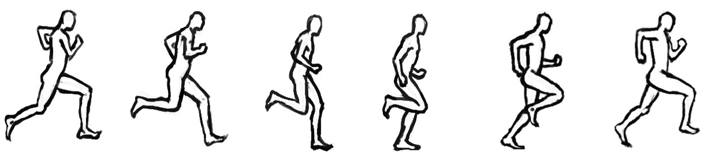

# Sympl


Sympl is a JavaScript tweening engine easy animations, incorporating optimised Robert Penner's equations. It is a lightweight library meant to be encapsulated by higher level tools.

## Installation
Download the minified library and include it in your code:
```html
<script src="Sympl.js"></script>
```
## Easing Functions

* easeLinear
* easeInQuad
* easeOutQuad
* easeInCubic
* easeOutCubic
* easeInQuart
* easeOutQuart
* easeInQuint
* easeOutQuint
* easeInSine
* easeOutSine
* easeInOutSine
* easeInExpo
* easeOutExpo
* easeInCirc
* easeOutCirc
* easeInElastic
* easeOutElastic
* easeInBack
* easeOutBack
* easeInBounce
* easeOutBounce
* easeInOutBounce

## Authors
Sufien Tout ([@suft](https://github.com/suft "Sufien"))  
Sufien ([@beidouz](https://github.com/beidouz "Beidou"))

## Contribute
To contribute to Sympl, clone this repo locally and commit your code on a seperate branch.

## License
Sympl is distributed under the MIT license. You are encouraged to use and modify the code to suit your needs, as well as redistribute it.
